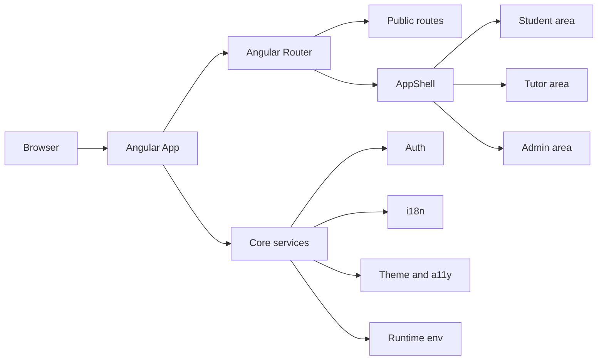
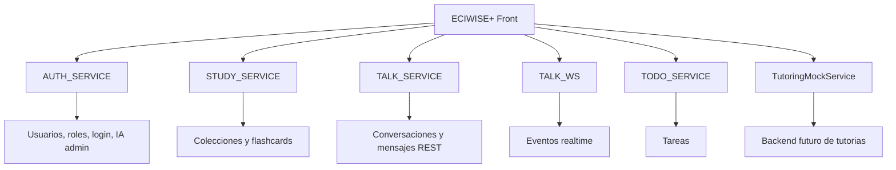
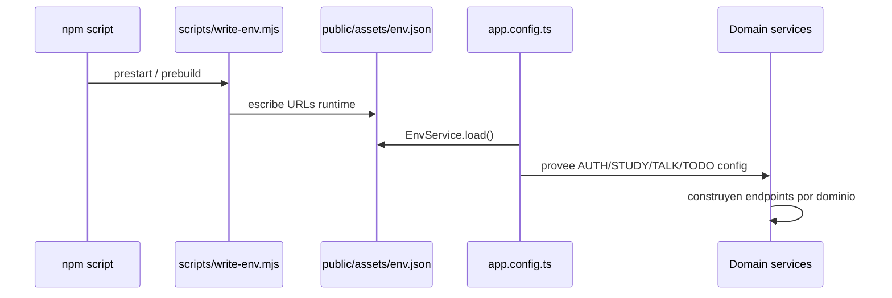

# ECIWISE+ Front

Frontend institucional de ECIWISE+, la plataforma de apoyo al aprendizaje de la Escuela Colombiana de Ingenieria Julio Garavito.

La aplicacion esta construida con Angular 21, componentes standalone, SSR, rutas lazy por rol, i18n, accesibilidad, chat, aprendizaje, tutorias y administracion.

## Stack

| Area | Tecnologia |
| --- | --- |
| Framework | Angular 21 |
| Rendering | Angular SSR con Express |
| UI | Componentes standalone, CSS tokens, Lucide icons |
| Estado | `signal`, `computed`, servicios inyectables |
| Formularios | Reactive Forms y Signal Forms |
| i18n | `@ngx-translate/core` |
| Chat | REST + WebSocket/STOMP |
| Docs | VitePress 1.x |
| Tests | Angular test builder sobre Vitest, Playwright |

## Funcionalidades

- Landing publica, login, registro y callback OAuth.
- Areas autenticadas por rol: estudiante, tutor y administrador.
- Modo claro/oscuro, modo accesibilidad e idioma de aplicacion.
- Perfil de usuario y gestion de sesion JWT.
- Tutorías academicas mockeadas con busqueda, reserva, agenda, disponibilidad, asistencia, reputacion, evaluaciones, recomendaciones y estadisticas.
- Aprendizaje con colecciones, flashcards, estudio y estadisticas.
- Chat institucional con conversaciones, grupos, adjuntos, reacciones, lectura, typing y moderacion.
- IA academica para predicciones, estadisticas y asignaciones.
- Administracion de usuarios, roles, estado y carga CSV.
- Documentacion VitePress multi-idioma con selector de idioma y tema claro/oscuro.

## Requisitos

- Node.js compatible con Angular 21.
- npm 11, indicado por `packageManager`.

## Configuracion

Copia `.env.template` a `.env` y ajusta los servicios:

```ini
PORT=4000
AUTH_SERVICE=http://localhost:3001
STUDY_SERVICE=http://localhost:8082
TALK_SERVICE=http://localhost:3003
TALK_WS=ws://localhost:3003/ws/chat
TODO_SERVICE=http://localhost:8083
```

El script `scripts/write-env.mjs` genera `public/assets/env.json` antes de `start` y `build`.

## Instalacion

```powershell
npm install
```

## Comandos

| Comando | Descripcion |
| --- | --- |
| `npm start` | Prepara env y levanta el servidor de desarrollo configurado por `scripts/serve.mjs`. |
| `npm run ng -- serve` | Levanta Angular CLI directamente. |
| `npm run build` | Compila la aplicacion Angular con SSR en `dist/ECIWISE-Front`. |
| `npm run watch` | Build Angular en modo watch de desarrollo. |
| `npm run serve:ssr:ECIWISE-Front` | Ejecuta el servidor SSR generado. |
| `npm run lint` | Ejecuta ESLint. |
| `npm run lint:fix` | Ejecuta ESLint con autofix. |
| `npm run lint:ci` | Ejecuta el ratchet de lint. |
| `npm run lint:baseline` | Actualiza baseline de lint. |
| `npm run test` | Ejecuta tests en modo Angular default. |
| `npm run test:ci` | Ejecuta tests una vez, sin watch. |
| `npm run test:unit` | Ejecuta specs unitarios. |
| `npm run test:integration` | Ejecuta specs de integracion. |
| `npm run test:coverage` | Ejecuta tests con cobertura. |
| `npm run e2e` | Ejecuta Playwright. |
| `npm run e2e:headed` | Ejecuta Playwright con navegador visible. |
| `npm run e2e:ui` | Abre la UI de Playwright. |
| `npm run docs:dev` | Levanta VitePress en `http://localhost:5173`. |
| `npm run docs:build` | Construye la documentacion en `docs/.vitepress/dist`. |
| `npm run docs:preview` | Sirve el build de documentacion. |

## Documentacion

La documentacion vive en `docs/` y usa VitePress.

Idiomas disponibles:

- Espanol: `/`
- English: `/en/`
- Francais: `/fr/`
- Portugues: `/pt/`
- Deutsch: `/de/`

VitePress muestra automaticamente el selector de idioma en la barra superior. El cambio de tema claro/oscuro tambien esta habilitado desde el control de apariencia del tema default.

```powershell
npm run docs:dev
npm run docs:build
npm run docs:preview
```

## Arquitectura base



## Integraciones backend



## Bootstrap y configuracion runtime



## Rutas por rol

```mermaid
flowchart TD
  Root[/ /] --> Landing[Landing]
  Root --> Login[/auth/login]
  Root --> Register[/auth/register]
  Root --> Student[/student]
  Root --> Tutor[/tutor]
  Root --> Admin[/admin]

  Student --> STutorias[/student/tutorias]
  Student --> STasks[/student/tasks]
  Student --> SLearning[/student/aprendizaje]
  Student --> SProfile[/student/profile]

  Tutor --> TSchedule[/tutor/schedule]
  Tutor --> TAvailability[/tutor/availability]
  Tutor --> TStudents[/tutor/estudiantes]

  Admin --> AUsers[/admin/users]
  Admin --> AStats[/admin/estadisticas]
  Admin --> AAssignments[/admin/asignaciones]
```

## Estructura

```text
src/
  app/
    core/       # auth, http, i18n, theme, a11y, config, IA
    features/   # auth, student, tutor, admin, aprendizaje, chat, landing
    shared/     # layout, UI y utilidades
  styles.css    # tokens, temas, a11y y estilos base
docs/
  .vitepress/   # configuracion y tema de documentacion
  guide/
  features/
  development/
```

## Calidad

Antes de entregar cambios relevantes:

```powershell
npm run lint
npm run test:ci
npm run build
npm run docs:build
```

Si se modifican flujos visuales criticos:

```powershell
npm run e2e
```

## Notas de desarrollo

- Usar componentes standalone con `ChangeDetectionStrategy.OnPush`.
- Preferir `inject()`, `signal()` y `computed()`.
- Reutilizar `eci-button`, `eci-card`, `eci-select`, `eci-modal`, `eci-page-header` y `eci-section-tabs`.
- No hardcodear textos visibles de UI; usar traducciones en `src/app/core/i18n/translations`.
- Mantener estilos con tokens globales de `src/styles.css`.
- No introducir nuevas dependencias sin una razon clara.
