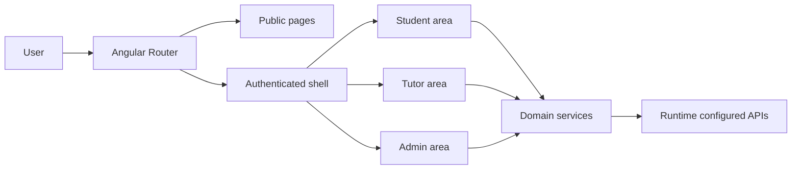

# Frontend architecture

## Executive summary

ECIWISE+ Front is an Angular 21 SSR application organized around role-based experiences, shared UI primitives and runtime-configured backend integrations. It supports public onboarding, student workflows, tutor operations, administration, learning, practice, tasks, chat, AI support, notifications, accessibility and internationalization.

## Architectural model

| Layer | Responsibility |
| --- | --- |
| Root app | Bootstrap, providers, router and SSR merge |
| Core | Authentication, HTTP, config, i18n, theme, accessibility, IA and notifications |
| Features | Domain screens and feature-owned services |
| Shared layout | App shell, top bar, side nav, floating actions and notifications |
| Shared UI | Reusable controls and visual primitives |

## Flow

## Integration points

- Auth API for session, users and profile.
- Study API for flashcards and practice.
- Talk REST and WebSocket APIs for chat.
- Todo API for tasks.
- Local tutorship mock service ready to be replaced by a backend facade.

## Engineering strengths

- Lazy role routes.
- SSR with hydration.
- Runtime environment configuration.
- Token-safe auth interceptor.
- Shared UI system.
- Test coverage around core business rules.
- Multi-language documentation and app translations.

