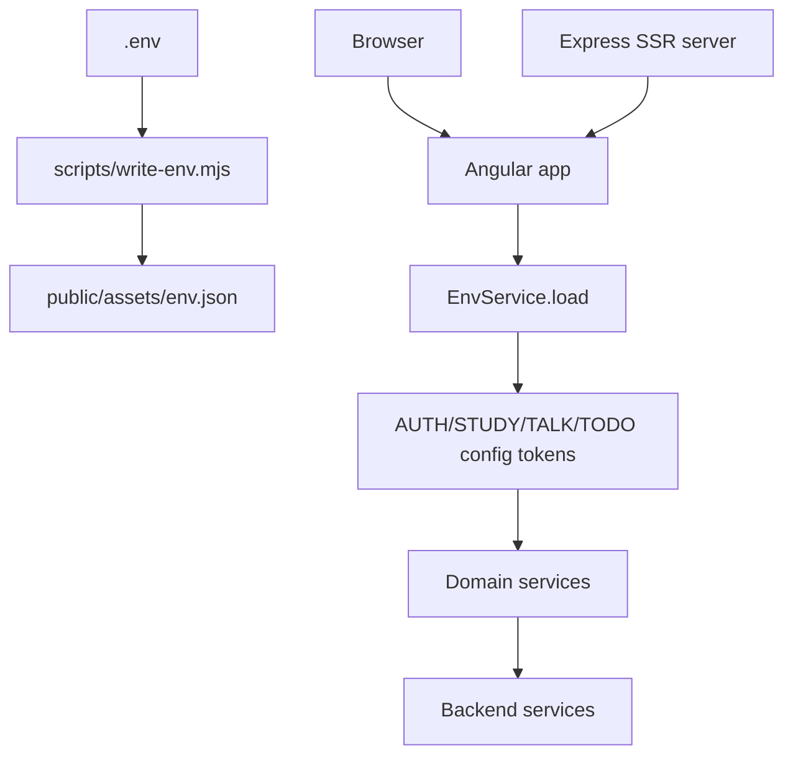

# Architecture

The frontend is organized as an Angular application with a thin root, role-specific lazy areas, cross-cutting core services and a shared shell/UI layer. The same application is rendered through Angular SSR and hydrated in the browser.

## Bootstrap pipeline

`src/app/app.config.ts` is the central application configuration. It registers:

- `provideRouter(routes, withInMemoryScrolling(...), withViewTransitions())`.
- `provideClientHydration(withEventReplay())`.
- `provideHttpClient(withFetch(), withInterceptors([...]))`.
- `provideTranslateService(...)`.
- App initializers for theme, language, accessibility and runtime config.
- Backend configuration tokens for auth, study, talk and todo services.

`src/app/app.config.server.ts` merges this browser/shared configuration with `provideServerRendering(withRoutes(serverRoutes))`.

## Runtime flow

## Layering

| Layer | Folder | Responsibility |
| --- | --- | --- |
| Root app | `src/app/app.*` | Bootstrap, routes, root shell connection |
| Core | `src/app/core` | Auth, HTTP, config, i18n, theme, accessibility, IA, notifications and models |
| Features | `src/app/features` | Business screens and feature-owned services |
| Shared layout | `src/app/shared/layout` | Authenticated shell, side nav, top bar, floating actions and dashboard grid |
| Shared UI | `src/app/shared/ui` | Reusable primitives such as button, modal, select, charts and pickers |
| Shared styles/util | `src/app/shared/styles`, `src/app/shared/util` | CSS utilities and non-UI helpers |

## State model

State is intentionally local to services and feature components:

- `AuthService` owns session, token, user, role and profile updates.
- `ThemeService`, `I18nService` and `A11yService` own UI preferences.
- `NotificationsService` owns the notification list and unread counts.
- `ChatService` orchestrates chat state while delegating REST and realtime transport.
- `TasksService`, `AprendizajeService`, `PracticaService`, `UserAdminService` and IA services own backend-facing domain state.
- Tutorship data is currently centralized in `TutoringMockService`.

Components use signals and computed values for view state. Services hide endpoint details and transformations.

## HTTP architecture

The app config registers two interceptors:

- `authInterceptor`: attaches the bearer token only to known first-party API hosts.
- `errorInterceptor`: normalizes HTTP/network failures to `AppError` translation keys and handles expired-token logout on own APIs.

Host safety lives in `src/app/core/config/api-hosts.ts`, and URL normalization lives in `src/app/core/config/url.util.ts`.

## SSR constraints

Because the app is rendered on the server:

- `localStorage`, `window`, `document`, media queries and DOM measurement must be browser-guarded.
- Services that persist preferences check `PLATFORM_ID`.
- Floating UI components that measure viewport must handle missing browser globals.
- Server routes use `src/app/app.routes.server.ts`: the landing route is prerendered and other routes are rendered on the client.

## UI architecture

Authenticated areas render through `AppShellComponent`:

- `TopBarComponent` exposes logo, preferences and session actions.
- `SideNavComponent` derives items from `navItemsFor(this.auth.role())`.
- `FloatingActionsComponent` exposes chat and assistant panels.
- `NotificationsBellComponent` exposes unread notification state.

This prevents each role area from duplicating navigation, preferences and global actions.

## Main files

- `src/app/app.config.ts`
- `src/app/app.config.server.ts`
- `src/app/app.routes.ts`
- `src/app/app.routes.server.ts`
- `src/server.ts`
- `src/app/core/auth/auth.interceptor.ts`
- `src/app/core/http/error.interceptor.ts`
- `src/app/shared/layout/app-shell`
